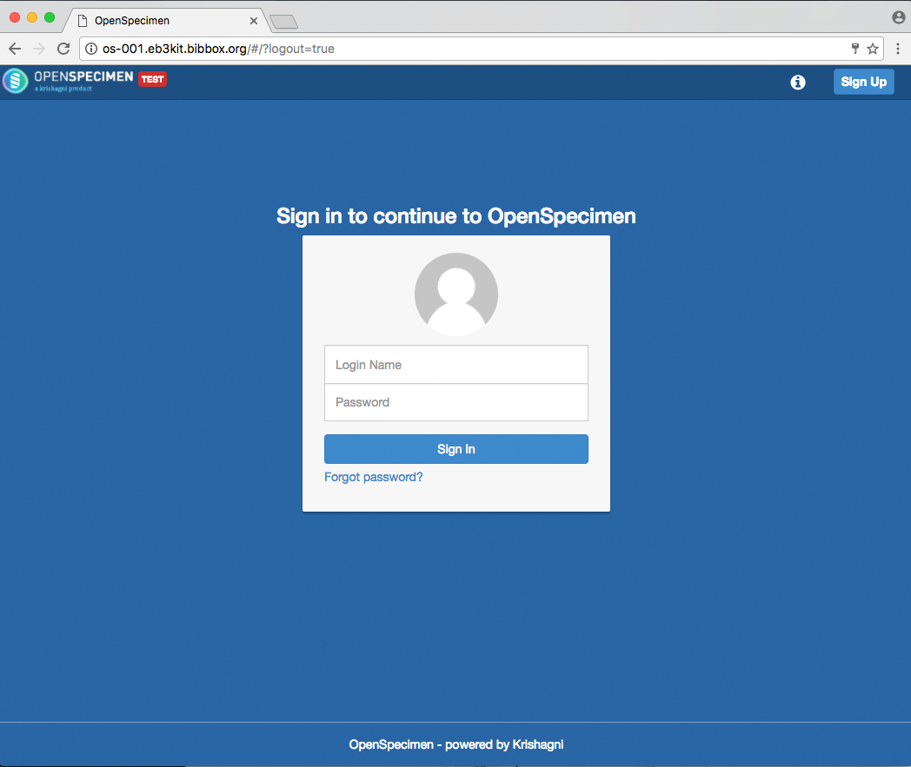
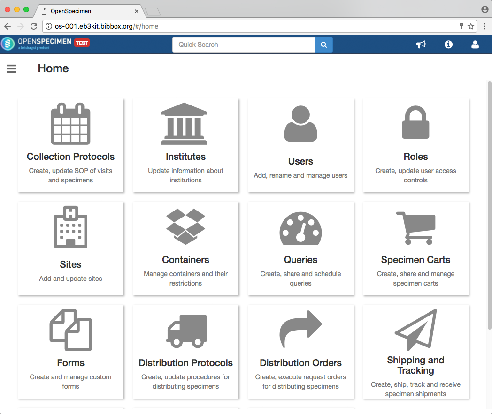

##  Installation  

* Install the application from BIBBOX store
* Wait for installation to finish
* After installation in BIBBOX, Open Specimen will take some minutes to set up internally
* Start the application from BIBBOX application screen
* Log into Open Specimen with user "bibboxadmin" and password "Login!@3"

* After Open Specimen has finished its internal setup process, den Login screen can be accessed. (This can take several minutes)

* After logging into the application, the user will have access to the Open Specimen dashboard and the application is ready to user
* Don't forget to change the default access credentials!

### First Steps 

Openspecimen provides a community and an enterprose version. With the community version it is possible to organsie simple collections and user data export/import features. The enterprise version provides additional modules for dashboards and simple data entry. 

Before you can add a Specimen, you have to make some configurations for a study

* Define a Collection Protocol
  * Setting up consents
  * Adding Events 
  * Define Specimen Requirements
  * Label Formats and Print Settings
  
For a deatiled description see [How to Create a Collection Protokol](https://openspecimen.atlassian.net/wiki/display/CAT/Collection+Protocol#CollectionProtocol-SpecimenCentricCollectionProtocol) or watch some of the [tutorial videos](https://www.youtube.com/watch?v=R-QpuAzvkO0&list=PLLFI_6gCd35OsTcZ_FtHVyQooIOR9w9F8&index=3)

Experienced programmers can easy write their own modules and/or user the REST Interface by looking at the source code in Github or even write a own plugin <https://openspecimen.atlassian.net/wiki/pages/viewpage.action?pageId=31064072>

