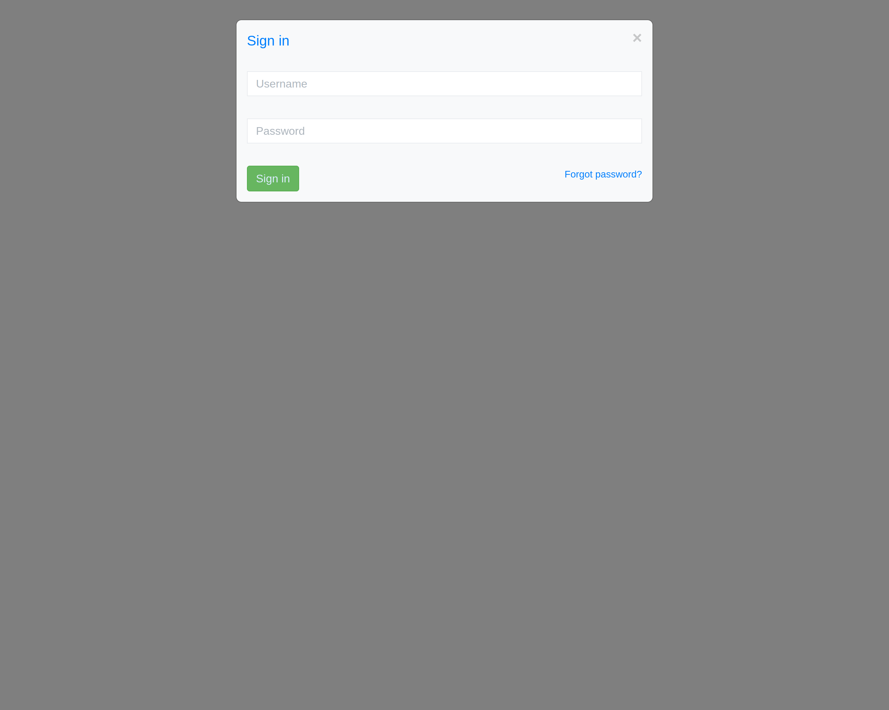
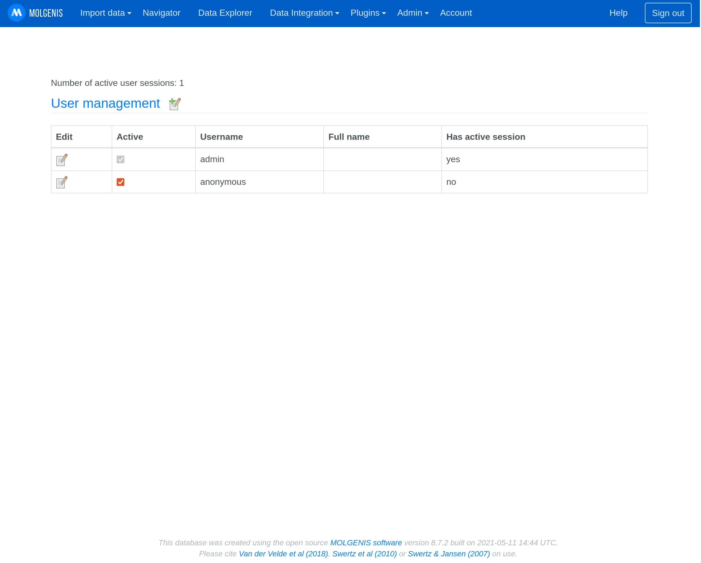
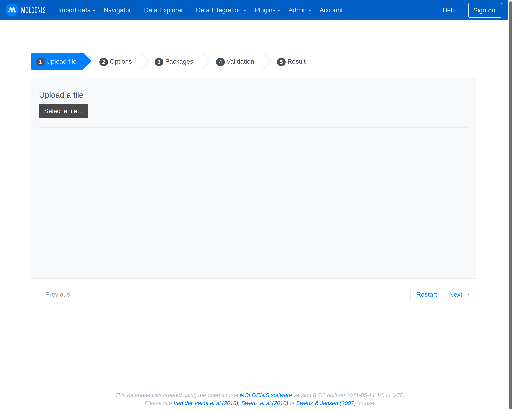
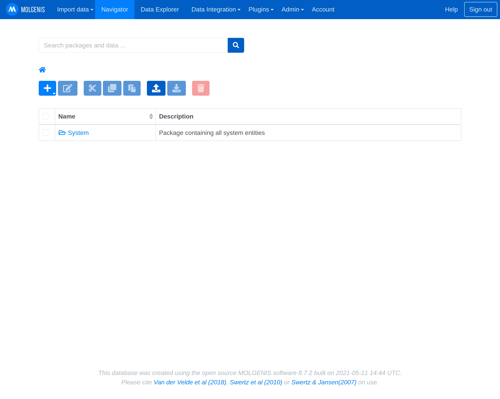

## Molgenis Installation Instructions 

### Start Molgenis

Be patient this can take up to 5 minutes (its a huge app). The last message in the log should be something like this

`17-Sep-2021 07:24:16.134 INFO [main] org.apache.catalina.startup.HostConfig.deployDirectory Deploying web application directory [/usr/local/tomcat/webapps/ROOT]`

### Log in with the username admin and the password you specified in the installation 

### Make all further configuration steps within the Molgenis app.
Further information can be found here https://molgenis.org/ and https://molgenis.gitbook.io/molgenis/.

#### Add and manage user permissions in the Admin/User Manager Menu.

#### Upload your data using the Molgenis EMX format.
Other fromats like `.csv` and `.vcf` are also supported and can be nativly uploaded.

#### Navigate through your data using the Navigator.

## After the installation
Have a nice ride with the Admins youngtimer.

