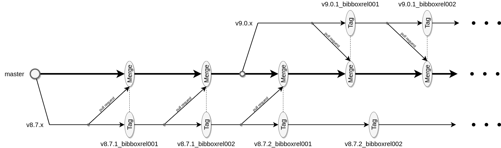

#  BIBBOX developer guide

Basically the  BIBBOX itsself consists of a series of docker containers. The basic container strucutre is given by:

* Apache Proxyserver (Front-End Server and Proxy Server for the Apps)
* Backend (Flask Rest API for data exchange from Front-End) 
* Postgres (Permanent Data Storage)
* Celery (Asynchronous Task scheduling)
* Redis (Faster data-store for volatile and cache data)

For more information about each container itsself see the sys-bibbox GitHub repository at <a href="https://github.com/bibbox/sys-bibbox" target="_blank">sys-bibbox</a>.


## Developer Documentation

#### Project structure and outline

The  BIBBOX docker system can mainly be divided into 3 parts:

* **Front End**
    * Angular Front End (Precompiled and mounted within the proxy container <a href="https://github.com/bibbox/sys-bibbox/tree/master/frontend" target="_blank">frontend</a>) 

* **Back End**
    * Flask Backend container (<a href="https://github.com/bibbox/sys-bibbox/tree/master/backend" target="_blank">backend</a>)
    * Celery Container (<a href="https://github.com/bibbox/sys-bibbox/tree/master/backend" target="_blank">backend</a>) Celery and backend use the same Docker image)
    * Postgres DB (<a href="https://github.com/bibbox/sys-bibbox/blob/master/postgresql" target="_blank">postgresql</a>)
    * Redis Data Store (Official Redis Docker image. Used by Celery as cache store)
    * Adminer (Official Docker image for DB debugging)
    * Celery Monitor (Celery container with Frotnend to debug asynchronous tasks)
    * cadvisor (Monitoring for the complete docker-compose bibbox chain)

* **Apacheproxy** (Main linking centerpoint <a href="https://github.com/bibbox/sys-bibbox/tree/master/apacheproxy" target="_blank">apacheproxy</a>)

To get an idea how this works in an easier fashion you can have a look at <a href="https://github.com/mrsan22/Angular-Flask-Docker-Skeleton" target="_blank">Angular-Flask-Docker-Skeleton</a>, which served as base for the work done on the  BIBBOX docker framework. The nginx implementation was replaced by Apache since this offered a more convenient workflow.

#### Prequisites

The following applications need to be installed or are installed using the INSTALL.sh script:

* Docker and docker-compose
* nodejs, nvm (Node version manager) and npm (node package manager) (see INSTALL.sh for version details)
* Python 3.x (see requirements.txt in the repository for more information on python requirements)

#### Front-End Details

* The Frontend is angular based and uses the ngrx-store principle to achieve the desired functionality (<a href="https://ngrx.io/guide/store" target="_blank">https://ngrx.io/guide/store</a>).
**Code Structure:**
* ***Part I: Everything visible in the Frontend is a component uses functions defined in the ngrx store part.***<br>
sys-bibbox/frontend/src<br>
├── app<br>
│   ├── app.module.ts<br>
│   ├── app-routing.module.ts<br>
│   ├── commons.ts<br>
│   ├── components<br>
│   │   ├── about<br>
│   │   │   ├── contact<br>
│   │   │   │   ├── contact.component.html<br>
│   │   │   │   ├── contact.component.scss<br>
│   │   │   │   ├── contact.component.spec.ts<br>
│   │   │   │   └── contact.component.ts<br>
│   │   │   ├── imprint<br>
│   │   │   │   ├── imprint.component.html<br>
│   │   │   │   ├── imprint.component.scss<br>
│   │   │   │   ├── imprint.component.spec.ts<br>
│   │   │   │   └── imprint.component.ts<br>
│   │   │   └── partners<br>
│   │   │       ├── partners.component.html<br>
│   │   │       ├── partners.component.scss<br>
│   │   │       ├── partners.component.spec.ts<br>
│   │   │       └── partners.component.ts<br>
│   │   ├── activities<br>
│   │   │   ├── activities.component.html<br>
│   │   │   ├── activities.component.scss<br>
│   │   │   ├── activities.component.spec.ts<br>
│   │   │   ├── activities.component.ts<br>
│   │   │   └── activity-menu-overlay<br>
│   │   │       ├── activity-menu-overlay.component.html<br>
│   │   │       ├── activity-menu-overlay.component.scss<br>
│   │   │       ├── activity-menu-overlay.component.spec.ts<br>
│   │   │       └── activity-menu-overlay.component.ts<br>
│   │   ├── applications<br>
│   │   │   ├── application-group<br>
│   │   │   │   ├── application-group.component.html<br>
│   │   │   │   ├── application-group.component.scss<br>
│   │   │   │   ├── application-group.component.spec.ts<br>
│   │   │   │   ├── application-group.component.ts<br>
│   │   │   │   └── application-tile<br>
│   │   │   │       ├── application-tile.component.html<br>
│   │   │   │       ├── application-tile.component.scss<br>
│   │   │   │       ├── application-tile.component.spec.ts<br>
│   │   │   │       └── application-tile.component.ts<br>
│   │   │   ├── applications.component.html<br>
│   │   │   ├── applications.component.scss<br>
│   │   │   ├── applications.component.spec.ts<br>
│   │   │   ├── applications.component.ts<br>
│   │   │   ├── install-screen<br>
│   │   │   │   ├── install-screen.component.html<br>
│   │   │   │   ├── install-screen.component.scss<br>
│   │   │   │   ├── install-screen.component.spec.ts<br>
│   │   │   │   └── install-screen.component.ts<br>
│   │   │   └── install-screen-dialog<br>
│   │   │       ├── install-screen-dialog.component.html<br>
│   │   │       ├── install-screen-dialog.component.scss<br>
│   │   │       ├── install-screen-dialog.component.spec.ts<br>
│   │   │       └── install-screen-dialog.component.ts<br>
│   │   ├── app-scaffold<br>
│   │   │   ├── app.component.html<br>
│   │   │   ├── app.component.scss<br>
│   │   │   ├── app.component.spec.ts<br>
│   │   │   ├── app.component.ts<br>
│   │   │   ├── footer<br>
│   │   │   │   ├── footer.component.html<br>
│   │   │   │   ├── footer.component.scss<br>
│   │   │   │   ├── footer.component.spec.ts<br>
│   │   │   │   └── footer.component.ts<br>
│   │   │   └── header<br>
│   │   │       ├── header.component.html<br>
│   │   │       ├── header.component.scss<br>
│   │   │       ├── header.component.spec.ts<br>
│   │   │       └── header.component.ts<br>
│   │   ├── instances<br>
│   │   │   ├── instance-detail-page<br>
│   │   │   │   ├── instance-detail-page.component.html<br>
│   │   │   │   ├── instance-detail-page.component.scss<br>
│   │   │   │   ├── instance-detail-page.component.spec.ts<br>
│   │   │   │   └── instance-detail-page.component.ts<br>
│   │   │   ├── instances.component.html<br>
│   │   │   ├── instances.component.scss<br>
│   │   │   ├── instances.component.spec.ts<br>
│   │   │   ├── instances.component.ts<br>
│   │   │   └── instance-tile<br>
│   │   │       ├── instance-tile.component.html<br>
│   │   │       ├── instance-tile.component.scss<br>
│   │   │       ├── instance-tile.component.spec.ts<br>
│   │   │       └── instance-tile.component.ts<br>
│   │   ├── login ***TODO***<br>
│   │   │   ├── login.component.html<br>
│   │   │   ├── login.component.scss<br>
│   │   │   ├── login.component.spec.ts<br>
│   │   │   └── login.component.ts<br>
│   │   ├── not-found<br>
│   │   │   ├── not-found.component.html<br>
│   │   │   ├── not-found.component.scss<br>
│   │   │   ├── not-found.component.spec.ts<br>
│   │   │   └── not-found.component.ts<br>
│   │   └── sys-logs<br>
│   │       ├── sys-logs.component.html<br>
│   │       ├── sys-logs.component.scss<br>
│   │       ├── sys-logs.component.spec.ts<br>
│   │       └── sys-logs.component.ts<br>
│   ├── httperror.interceptor.ts<br>

* ***Part II: Store part implement all the actions, effects, models, reducers, selectors and services:*** <br>
│   └── store<br>
│       ├── actions<br>
│       │   ├── activity.actions.ts<br>
│       │   ├── applications.actions.ts<br>
│       │   └── instance.actions.ts<br>
│       ├── effects<br>
│       │   ├── activity.effects.ts<br>
│       │   ├── applications.effects.ts<br>
│       │   └── instance.effects.ts<br>
│       ├── models<br>
│       │   ├── activity.model.ts<br>
│       │   ├── application-group-item.model.ts<br>
│       │   ├── app-state.model.ts<br>
│       │   └── instance-item.model.ts<br>
│       ├── reducers<br>
│       │   ├── activity.reducer.ts<br>
│       │   ├── application-group.reducer.ts<br>
│       │   └── instance.reducer.ts<br>
│       ├── selectors<br>
│       │   ├── activity.selector.ts<br>
│       │   ├── application-group.selector.ts<br>
│       │   └── instance.selector.ts<br>
│       └── services<br>
│           ├── activity.service.spec.ts<br>
│           ├── activity.service.ts<br>
│           ├── application.service.spec.ts<br>
│           ├── application.service.ts<br>
│           ├── auth.service.spec.ts<br>
│           ├── auth.service.ts<br>
│           ├── instance.service.spec.ts<br>
│           ├── instance.service.ts<br>
│           ├── login.service.spec.ts<br>
│           ├── login.service.ts<br>
│           ├── socketio.service.spec.ts<br>
│           ├── socketio.service.ts<br>
│           ├── validator.service.spec.ts<br>
│           └── validator.service.ts<br>
├── app.config.ts (created by Angular CLI) <br> 
***Note that this exactly resembels the structure given in the NGRx tutorial (<a href="https://ngrx.io/guide/store" target="_blank">https://ngrx.io/guide/store</a>).***<br>
* ***Part III images and build environments*** <br>
├── assets<br>
│   ├── announced.png<br>
│   ├── b3africa.png<br>
│   ├── bbmri-eric.png<br>
│   ├── close.png<br>
│   ├── done.png<br>
│   ├── error.png<br>
│   ├── external_ref.png<br>
│   ├── favicon.ico<br>
│   ├── furley_bg.png<br>
│   ├── loading.gif<br>
│   ├── loading_old.gif<br>
│   ├── lock.png<br>
│   ├── new.png<br>
│   ├── pawn_small.png<br>
│   ├── silicolab_logo.png<br>
│   ├── silicolab_logo_small.png<br>
│   ├── silicolab_logo.svg<br>
│   └── silicolab_logo_white.png<br>
├── environments<br>
│   ├── environment.prod.ts<br>
│   ├── environment.prod.ts.template<br>
│   ├── environment.ts<br>
│   └── environment.ts.template<br>
* Standart angular files mostly generated by the Angular CLI (edited in cases)<br>
├── favicon.ico<br>
├── index.html<br>
├── main.ts<br>
├── polyfills.ts<br>
├── proxy.conf.json<br>
├── styles.scss<br>
├── styles-variables.scss<br>
└── test.ts<br>

**Front end TODO'S**:

* Authentication for users; 
    * See tutorial here <a href="https://mherman.org/blog/authentication-in-angular-with-ngrx/" target="_blank">authentication-in-angular-with-ngrx</a>
* Styling

#### Back-End Details

The Backend code can be grouped the backend code regarding:<br>

* api: Code implementing the Flask API calls it uses code defined in
    * the  BIBBOX Folder: Implements the file handling and data I/O providing the neccesary JSON data  to the API calls.
* celery config files and tasks
* models contains the DB implementations for the database
    * services implements the SQL-Alchemy services consuming the models
* static features Api spec files in different formats
* util features constants and globals in a single script
* Other files cover init and configs for falsk and the neccesary interfaces

/opt/bibbox/sys-bibbox/backend/<br>
├── app<br>
* ***Part I: Main Code influencing Front end behaviour***<br>
│   ├── api<br>
│   │   ├── activity.py<br>
│   │   ├── apps.py<br>
│   │   ├── authentication.py<br>
│   │   ├── default.py<br>
│   │   ├── \_\_init\_\_.py<br>
│   │   └── instance.py<br>
│   ├── bibbox<br>
│   │   ├── app.py<br>
│   │   ├── docker_handler.py<br>
│   │   ├── file_handler.py<br>
│   │   ├── \_\_init\_\_.py<br>
│   │   ├── instance_controler.py<br>
│   │   ├── instance_handler.py<br>
│   │   └── instance.py<br>
* ***Part II DB and asynchronous Tasks***<br>
│   ├── celeryconfig.py<br>
│   ├── celerytasks<br>
│   │   ├── \_\_init\_\_.py<br>
│   │   └── tasks.py<br>
│   ├── dirty_test_code.py<br>
│   ├── \_\_init\_\_.py<br>
│   ├── models<br>
│   │   ├── activity.py<br>
│   │   ├── app.py<br>
│   │   ├── catalogue.py<br>
│   │   ├── \_\_init\_\_.py<br>
│   │   ├── log.py<br>
│   │   └── user.py<br>
│   ├── services<br>
│   │   ├── activity_service.py<br>
│   │   ├── app_service.py<br>
│   │   ├── catalogue_service.py<br>
│   │   ├── db_logger_service.py<br>
│   │   ├── \_\_init\_\_.py<br>
│   │   ├── log_service.py<br>
│   │   ├── socketio_service.py<br>
│   │   └── user_service.py<br>
│   ├── static<br>
│   │   ├── bibbox-api-spec old.yml<br>
│   │   ├── bibbox-api-spec.yml<br>
│   │   ├── main.html<br>
│   │   └── swagger.json<br>
│   ├── utility<br>
│   │   ├── celery_util.py<br>
│   │   └── \_\_init\_\_.py<br>
│   └── utils<br>
│       ├── common.py<br>
│       └── \_\_init\_\_.py<br>
* ***Part III: Init Stuff for websockets and Falsk + logs***<br>
├── celery_worker.py<br>
├── debug-test.py<br>
├── Dockerfile<br>
├── entrypoint.sh<br>
├── \_\_init\_\_.py<br>
├── logs<br>
│   ├── debug.log<br>
│   ├── error.log<br>
│   ├── info.log<br>
│   └── warning.log<br>
├── manage.py<br>
├── requirements.txt<br>
├── runflask.py<br>
├── settings.py<br>
├── uwsgi.ini<br>
├── uwsgi_params<br>
└── wsgi.py<br>

#### Set up Front-End Developement environment

* **Easiset way (Linux Debian based):**<br> 
    * Install  BIBBOX locally under linux (See [Install  BIBBOX](installation_v4_bibbox_linux))
    * Install an IDE (e.g <a href="https://code.visualstudio.com/download" target="_blank">VSCode</a>)
    * Set up local DNS Service (See [Install  BIBBOX](installation_v4_bibbox_linux))
    * Goto sys-bibbox/frontend 
    * Type `code .` into bash
    * After VS Code opens type `ng serve` 
    * Open the link the console shows you (If setup went correctly you should see a  BIBBOX interface without any errors) 
    * Change any code file and watch it change live in your browser.

* **NOTE**: Prequesite is that the DNS service and  BIBBOX installation fully works

##  Apps Creators Manual

### How to join the team

Contact [Heimo Müller](mailto:heimo.mueller@medunigraz.at), [Emilian Jungwirth](mailto:emilian.jungwirth@medunigraz.at) or [Markus Plass](mailto:markus.plass@medunigraz.at). Any of them can add you to the Github team of an App repository. 

### Anatomy of an App

An **App** is described within a BIBBOX GitHub repository. By convention the name of the repository starts with the prefix **"app-"**
A template repository can be found at:  <a href="https://github.com/bibbox/app-template" target="_blank">https://github.com/bibbox/app-template</a>


An **App** consists at least of the following files and directories, please never change the name of these files!

- README.md
- INSTALL-APP.md
- appinfo.json
- docker-compose.yml.template
- environment-parameters.json
- fileinfo.json
- icon.png

#### README.md

The default Github readme file shoud contain information about the used official docker images and docker images from the <a href="https://hub.docker.com/r/bibbox/" target="_blank">BIBBOX dockerhub/</a>. In addition you should describe all mounted volumes and their content.

  
#### INSTALL-APP.md

Install instruction for the App to follow after the first installation step (docker-compose up) is finished. This typically describes application specific configuration tasks. A link to this file is given in the Dashboard of the installed App. 
    
  
#### appinfo.json
    
Specifies information about the App as displayed in the BIBBOX App Store. 
    
``` json
    {
            "name": "A long name of the Application, shown in the App Store",
            "short_name": "APP short name",
            "version": "V.1.0",
            "description": "Long description of the Application shown in Store, can be multiline",
            "short_description": "Short description of the Application shown in Store",
            "catalogue_url": "URL to biobankapps, if applicaple",
            "application_url": "URL to App official gace",
            "tags": ["Tag1", "Tag2"]
    }
```

#### docker-compose.yml.template

Based on this file the docker-compose.yml will be generated. The variables §§INSTANCE and all other environment and configuration variables starting with "§§" will be replaced during the installation. Each template for a docker compose file should link to the `bibbox-default-network` network. The `proxy` and `ports` section is used to create a `005-§§INSTANCE.conf` proxy file. 

NOTE:

* Only use tagged images versions (not latest). To ensure that the app stays stable over time.
* Use the docker-compose `links` parameter to ensure that containers can "talk" to each other indent of the name set in §§INSTANCE.

    
``` yml
    version: '3'
    
    networks:
        bibbox-default-network:
          external: true
    
    services:
    
      §§INSTANCE-container-frontend:
        image: bibbox/app-image:vx.y.z
        container_name:  §§INSTANCE-container-frontend
        restart: unless-stopped
        networks:
          - bibbox-default-network
        links:
          - §§INSTANCE-container2:container2
        ports:
          - "80:80"
        depends_on:
          - §§INSTANCE-container2
        volumes: 
          - ./data/container/app-data:/app-data
        proxy:
          TYPE: PRIMARY
          URLPREFIX: §§INSTANCE
          TEMPLATE: default
          DISPLAYNAME: 'APP name'  

    §§INSTANCE-container2:
      image: bibbox/app-image2:va.b.c
      container_name:  §§INSTANCE-container2
      restart: unless-stopped
      networks:
        - bibbox-default-network
      links:
          - §§INSTANCE-app-db:app-db
      ports:
        - "8000:8000"
      depends_on:
          - §§INSTANCE-app-db
      volumes: 
        - ./data/container/app-data:/app-data
    
      §§INSTANCE-app-db:
        image: mysql:8
        container_name: §§INSTANCE-app-db
        restart: unless-stopped
        networks:
          - bibbox-default-network
        user: root
        environment:
          - MYSQL_ROOT_PASSWORD=thispasswordisneverusededoutsidethecontainer
          - MYSQL_DATABASE=§§MYSQL_DATABASE_NAME
          - MYSQL_USER=§§MYSQL_DATABASE_USER
          - MYSQL_PASSWORD=§§MYSQL_DATABASE_PASSWORD
        volumes: 
          - ./data/db/var/app-data:/var/app-data
    
```


#### environment-parameters.json

Environment parameters for the docker-compose-template file. The user can set the values for these parameters in a GUI during the installation of an App. 
   
    
```json
    [
       {
          "id":"NAME_AS_IN_DOCKER_TEMPLATE_1",
          "display_name":"Name Displayed in GUI at the Installation",
          "type":"text, number, password",
          "default_value":"Default Value",
          "description":"Description shown in the GUI",
          "min_length": "1",
          "max_length": "128"
       },
       {
          "id":"MYSQL_DATABASE_NAME",
          "display_name":"Name of the mysql database",
          "type":"text,",
          "default_value":"Default Value",
          "description":"Description shown in the GUI",
          "min_length": "1",
          "max_length": "128"
       },
       {
          "id":"MYSQL_DATABASE_USER",
          "display_name":"Name of the mysql user",
          "type":"text",
          "default_value":"Default Value",
          "description":"Description shown in the GUI",
          "min_length": "1",
          "max_length": "128"
       },
       {
          "id":"MYSQL_DATABASE_PASSWORD",
          "display_name":"Password of mySQL user",
          "type":"password",
          "default_value":"Default Value",
          "description":"Description shown in the GUI",
          "min_length": "1",
          "max_length": "128"
       }

    ]
```
  
#### fileinfo.json

A list of commands to be run when installing an app, consisting of three categories: "environmental_replace", "script_replace" and "permissions".

| key | description |
|---|---|
| environmental_replace | WIP - specifies files/directories where placeholders can be replaced easily |
| script_replace | WIP - specifies files/directories where placeholders etc. should be replaced by a script |
| permissions | specifies which files/folders in the instance directory should be set to which permissions. \n the path is always relative to the instance directory|    

Tool for calculating permissions: <a href="https://chmod-calculator.com/" target="_blank">https://chmod-calculator.com/</a>

structure:
``` json
    {
        "environment_replace": {},
        "script_replace": [],
        "permissions": {
            "PATH1": NUMERIC_VALUE_OF_PERMISSION1,
	    "PATH2": NUMERIC_VALUE_OF_PERMISSION2,
	    "PATH3": NUMERIC_VALUE_OF_PERMISSION3
	    }
    }
```

example:
``` json
    {
        "environment_replace": {},
        "script_replace": [],
        "permissions": {
            "assets": 775,
	    "data" : 777
	    }
    }
```
    

#### icon.png

Icon of the App in the application store und in the application dashboard. Please use a square format, e.g. 512x512 pixeland PNG with a transparency channel.
    

### Versioning

Each App should be versioned. We distinguish between

- **Production Versions** generated from a specific release in the repository. For each major release. i.e. given by a new version of dockerized software tool, a new branch should be generated in the repository. Please note, that the tag name for the Github release should contain the APP version and the BIBBOX APP release (adaption of the APP for BIBBOX). The proposed format is v*APP_verion*_bibboxrel*3 digit bibbox_release_number* e.g. `v8.7.2_bibboxrel001`. 
The `latest` stable release is in the master branch.

- **Development Version** comming soon. Branches and tags not specified in a **kit** can be loaded in a **Developer Mode**. 





When creating a production version, you should make the follwoing steps. Please make it exactly in this order, 
otherwise the tagging of the bibbox docker/hub and bibbox github will get confused.

1. Generate a new branch in github, if you plan to release a major version. 
  
	1. Once a stable bibbox release is ready create a tag in compliance with the naming convention (e.g. `v8.7.2_bibboxrel001`). 
  
	2. The latest app version should be merged in the master branch if a stable BIBBOX release exists via a pull request. 
  
2. Update all the files for the anticipated version, don't forget to update *appinfo.json*. 

3. Set in the docker compose template file (docker-compose.yml.template) 
the tags for the docker images. Please note, that ALL used images should be tagged with an specific version, don't use the 'latest" tag, as this could break your APP in the future. 

4. *Add the tag in the DOCKER hub to build tagged images (press SAVE before TRIGGER)*

5. Edit in the used kit, e.g. *bibbox.json* the version information. This file can be found in the *application-store* repository. 


### Register an App

For the registration of an App two configuration files have to be extended:

- <a href="https://github.com/bibbox/application-store/blob/master/applications.json" target="_blank">applications.json/</a> maps a Github repository to a human readable name of the App 


- <a href="https://github.com/bibbox/application-store/blob/master/bibbox.json" target="_blank">bibbox.json/</a> puts the App into a specific **kit**. A **kit** defines ta group of Apps together with metadata, which are then displayed in the App store and can be installed in a BIBBOX instance. 


