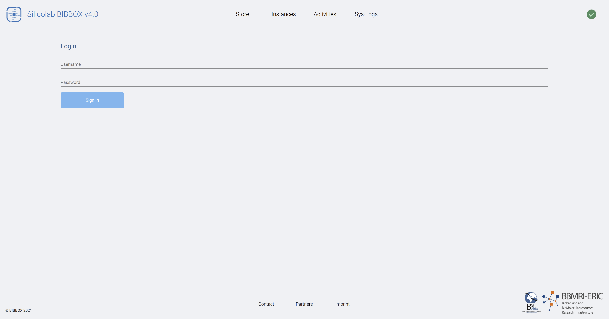
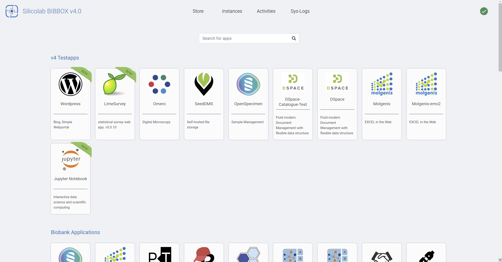
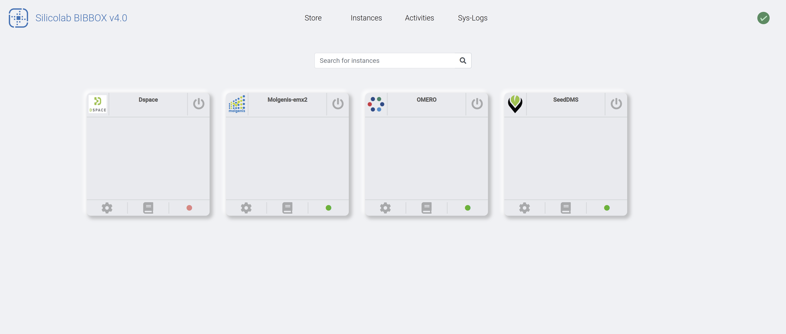
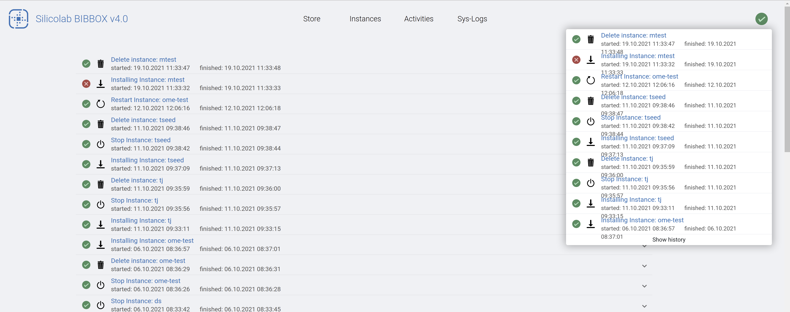
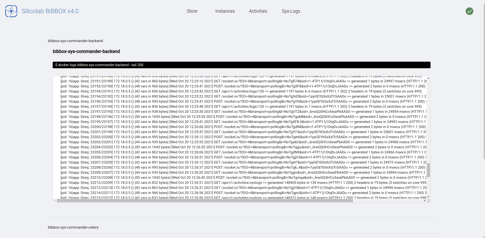
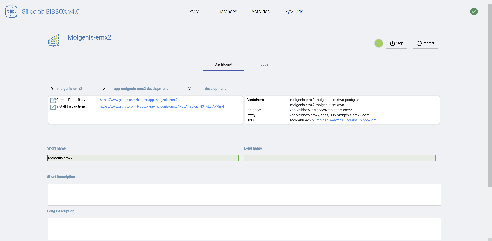
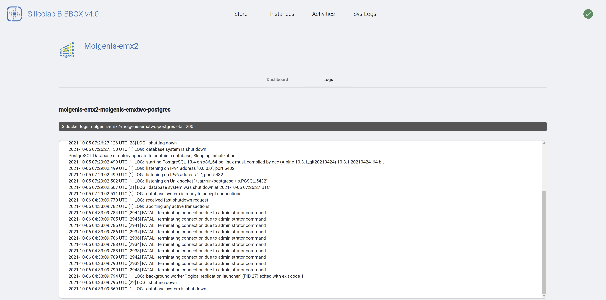

# BIBBOX System

This documentation describes the new angular based Bibbox Docker Framework.  
For the old framework documentation see the section **V3 - Old Documentation**

* If you already know your way arround Docker and just want to install a local instance on Linux jump to [Install Bibbox](V4 - Install Bibbox(Linux))

## Get started

* What is the Bibbox Framework ?

The Bibbox Framework originally was created to serve as a Biobank in a Box (hence Bibbox). So this means it provides the possibility to create install apps and serve them directly towards the End-User. In the current state we are building apps to support Pathologists and Biobanks in their direct work as well as in Data-Management. The current Framework mainly serves as a workflow demo SAAS-System and is not going into a productive state anytime soon. 

* How does it work ?

Basically the Bibbox itsself consists of a series of docker containers. The basic container strucutre is given by:

* Apache Proxyserver (Front-End Server and Proxy Server for the Apps)
* Backend (Flask Rest API for data exchange from Front-End) 
* Postgres (Permanent Data Storage)
* Celery (Asynchronous Task scheduling)
* Redis (Faster data-store for volatile and cache data)

For more information about each container itsself see the sys-bibbox GitHub repository at [https://github.com/bibbox/sys-bibbox](https://github.com/bibbox/sys-bibbox)

The detailed documentation is currently under construction and will be subsequently updated see [Developer Documentation](V4 - Developers)

##### Bibbox user interface overview
To get an overview over the new interface you can got to [http://silicolabv4.bibbox.org/](http://silicolabv4.bibbox.org/).

* NOTE: The user management is currently under developement and not implemented within the Backend.

By clicking onto the Store-Button on top you will get to the app overview. ([http://silicolabv4.bibbox.org/applications](http://silicolabv4.bibbox.org/applications)).

To learn more about installing an App goto [Install Apps](V4 - Install Apps)

Clicking onto the Instances-Button will take you to the currently running instances ([http://silicolabv4.bibbox.org/instances](http://silicolabv4.bibbox.org/instances)).  
* NOTE: If you installed your Bibbox locally you might have not installed any instances and this screen is empty.

The screen shows the currently running instances and offers more possibilities. You can:
* Call the Apps UI via the switch Button on the top left of the apps tile
* See the Apps dashboard by clicking the Gear Symbol on the bottom left of the apps tile
* Call the logs of the singular Docker containers by clicking the Book Symbol in the bottom-middle of the apps tile
* The light signifies the status of the app - Green: Running; Yellow: Installing; Red: Stopped

You might noticed, that on all screens there is a little green hook on the very top right of the page. This is a short link to the last page of the third page of top navigation bar: The activity menu. 

Here all the recently triggered actions can be reviewed. Additionally the status

* Hook == suceeded
* Red cross sign == failed
* Spinning Bar circle == task in Progression

is shown here. The dropdown menu alwys present on the top right just gives you a short update on the general status of recent event, while in the Activities tab each event can be expanded and contains a short descriptions about the nature of the given error.

As this might is not enough one can conveniently access the System logs from the main navigation as well. This tab shows the docker-logs of the main system containers.

Each Log can be expanded by clicking on it and shows the logs that are recorded by each individual docker container

* NOTE: This is also the fastest way to figure out the main structure of the Bibbox system
* NOTE: What is logged exactly is configured in the Docker Container definitions and can be found within the Dockerfiles within the GitHUb repository ([https://github.com/bibbox/sys-bibbox/tree/master/apacheproxy](https://github.com/bibbox/sys-bibbox/tree/master/apacheproxy) as an example for the Apache Proxy Server container)

As the information provided by the logs is sometimes not enough each App can be troubleshot in more detail by visiting the Dashboard (it can be accesed in the Instances Tab)

* NOTE: The most important part is the possibility to stop or restart apps.
* NOTE: Once an app has been stoped the button turns towards delete. THIS IS THE ONLY WAY TO DELETE APPS
* Additionally we can enter or read descriptions that are shown within the apps tile at the Instances tab. Further we can see all the available URL's for the given app. For example some apps include additional tools for debuging or advacned form of integration. An example would be an additional Adminer service that can be accesed to see the database.

Last we can also access the App-Container Docker logs from the Dashboard or via the Apps tile from the Instances tab (Book Symbol see Instances tab above). 

Here we can see a more detailed log of every container that is contributing to the given app. 

