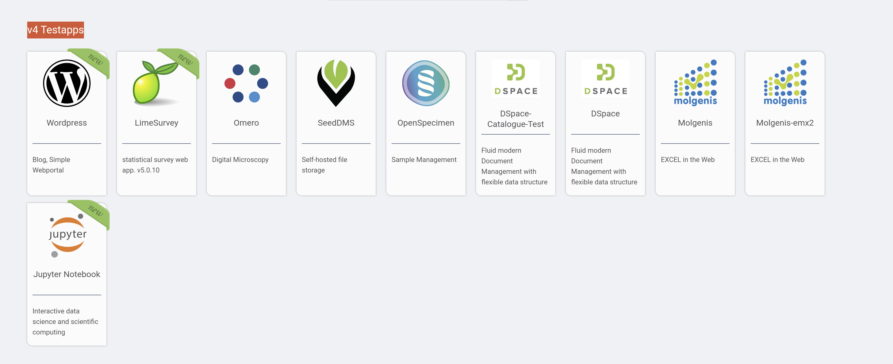
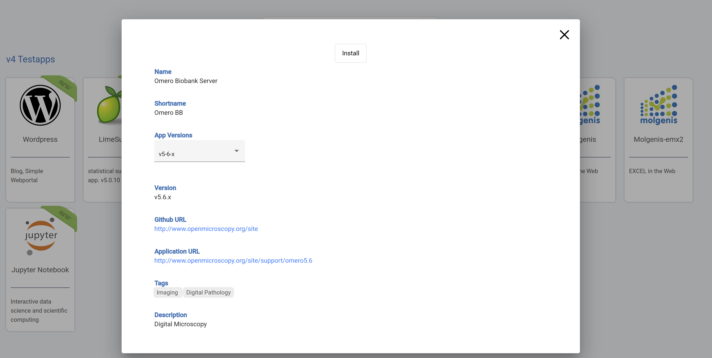
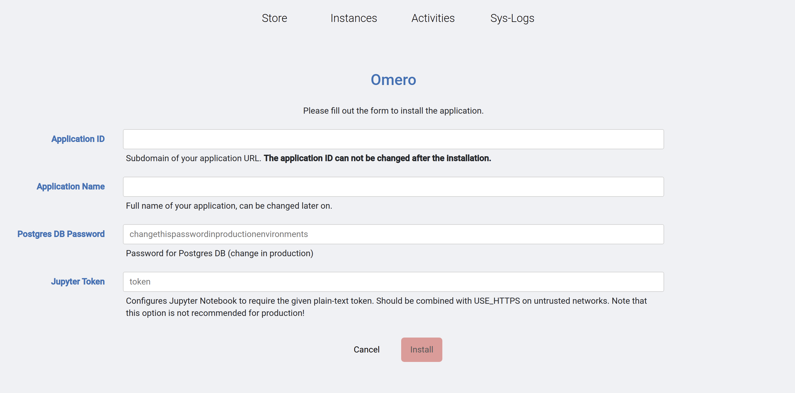

## Install Apps

Installing Apps on the new Framework can be tested at [http://silicolabv4.bibbox.org/applications](http://silicolabv4.bibbox.org/applications)

* NOTE: After first installation of the Framework the system automatically fetches the List of available
* NOTE: Only Apps listed as v4Testapps can be installed in the current Beta

Once you selected an app by clicking on its icon you will see a new window pop up. Since there can be different versions of an App available you have to select your version
* NOTE: Due to the BETA Stadium of the Bibbox project currently only one version per Testapp is available

After this click Install as shown on top of the image above. Next you will have to fill the parameters neccesary to actually run the app. 
The parameters themselves can be checked at the App's Git Hub repository. In the example the selected App is [https://www.openmicroscopy.org/omero/](Omero) 
After clicking onto Install you will be taken to the parameter setting screen:

To get to the GitHub repository outlining the parameters go to: [https://github.com/bibbox/app-omero/tree/v5-6-x](https://github.com/bibbox/app-omero/tree/v5-6-x)

