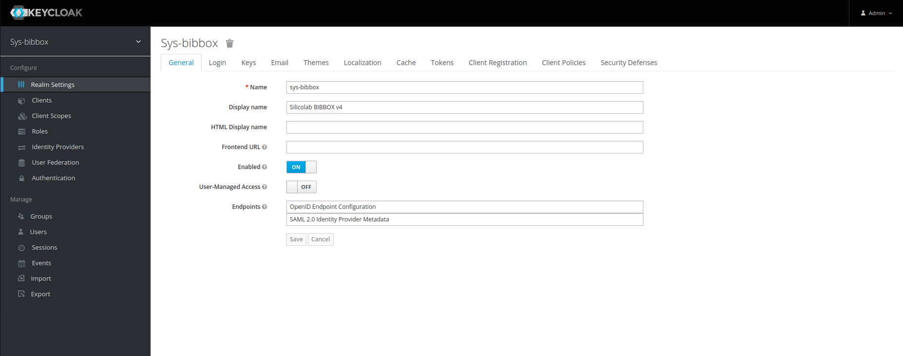
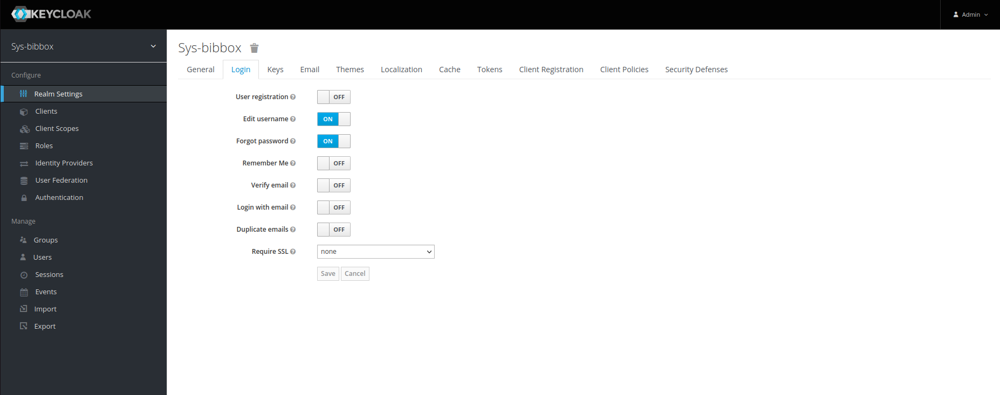
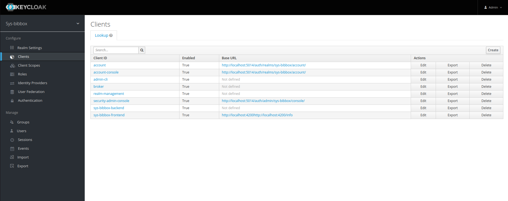
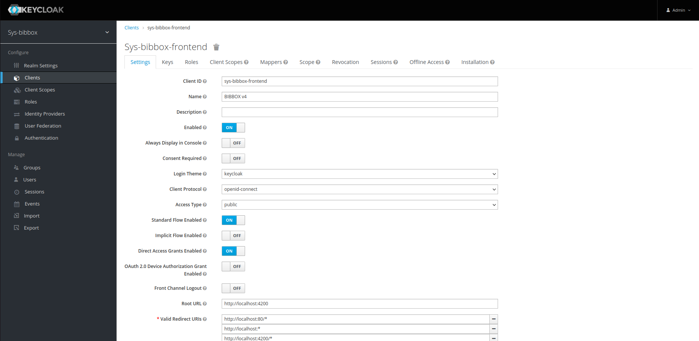
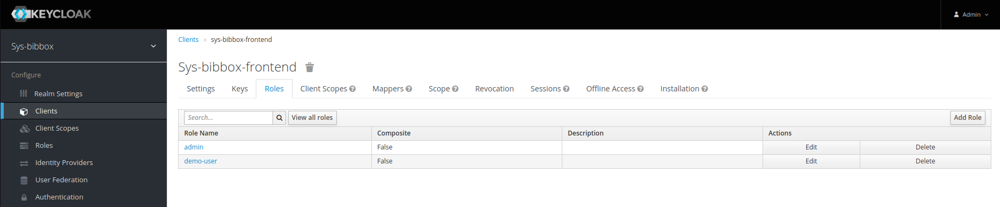

# User Management with Keycloak in Angular

## Prerequisites

In order to integrate Keycloak into your Angular application, you will need to make sure that the following prerequisites are met:

&nbsp;

**Admin Credentials in Docker-Compose File**: In your `docker-compose.yml` file, make sure that you have set the admin credentials for your Keycloak container as environment variables. These environment variables should be set as follows:

```yaml
environment:
    KEYCLOAK_ADMIN: admin
    KEYCLOAK_ADMIN_PASSWORD: admin
    ...
```

Replace the values `admin` and `admin_password` with your desired admin credentials. These credentials will be used to log in to the Keycloak admin console.

Additionally, make sure that you have set the necessary environment variables for connecting to your PostgreSQL database.

&nbsp;


**`KEYCLOAK_IMPORT` - Environment Variable**: This environment variable allows you to specify a custom Keycloak realm definition in JSON format. The realm definition can contain configurations for clients, roles, users, and more. To use a custom realm definition, uncomment the `KEYCLOAK_IMPORT` line in your `docker-compose.yml` file and specify the path to your JSON file, like this:

  ```yaml
  environment:
    ...
    KEYCLOAK_IMPORT: /path/to/your/realm-definition.json
  ```

  Replace `/path/to/your/realm-definition.json` with the path to your own custom realm definition file. Once you have specified this environment variable, Keycloak will import your custom realm definition when the container starts up. This can be useful if you want to pre-configure your Keycloak instance with clients, roles, and users, instead of having to manually set them up through the admin console.

&nbsp;


## Keycloak Integration in the Frontend Code

**Keycloak Integration in the Frontend Code**: In order to integrate Keycloak into your Angular application, you will need to set up the appropriate configuration values in your `environment.ts` file. The `KEYCLOAK_URL` property should be set to the URL of your Keycloak instance, the `KEYCLOAK_CLIENT_ID` should be set to the client ID of your Angular application, and the `KEYCLOAK_REALM` should be set to the name of your Keycloak realm. Additionally, you can specify an array of non-protected paths that should not trigger the Keycloak login flow using the `KEYCLOAK_NON_PROTECTED_PATHS` property. Finally, you can define the Keycloak roles that your application uses with the `KEYCLOAK_ROLES` property, and any other custom configuration options for Keycloak can be set in the `KEYCLOAK_CONFIG` object.

```typescript
  KEYCLOAK_URL: `http://localhost:5014`,
  KEYCLOAK_CLIENT_ID: 'sys-bibbox-frontend',
  KEYCLOAK_REALM: 'sys-bibbox',
  KEYCLOAK_NON_PROTECTED_PATHS: [
    '/logout',
    'https://raw.githubusercontent.com/',
  ],

  KEYCLOAK_ROLES : {
    admin: 'admin',
    demo_user: 'demo-user',
    standard_user: 'standard-user',
  },

  KEYCLOAK_CONFIG : {
    max_instances_per_demo_user: 3,
    resource_name: 'sys-bibbox-frontend',
  }
```

&nbsp;

**Protecting Routes in the Frontend Code**:
In the Angular application, the relevant frontend URLs are protected by an `AuthGuard`, which checks if the user has a valid Keycloak token before allowing access to the page. The canActivate property of each protected route in the routing module is set to the `AuthGuard`, so all routes are protected by default. If you want to add a new route that should also be protected, you can simply add the `canActivate` property to that route as well. Additionally, you can specify which Keycloak roles are allowed to access the route by using the data property and specifying the roles array, as shown in the code snippet. This provides a flexible and easy-to-use system for securing routes based on Keycloak roles.

```typescript
// app-routing.module.ts
  { path: 'applications', component: ApplicationsComponent, pathMatch: 'full', canActivate: [AuthGuard]},
  { path: 'instances', component: InstancesComponent, pathMatch: 'full', canActivate: [AuthGuard]},
  { path: 'sys-logs', component: SysLogsComponent, pathMatch: 'full', canActivate: [AuthGuard], data: {roles: [environment.KEYCLOAK_ROLES.admin]}},

// info page which is not protected, as any user should be able to access it
  { path: 'info', component: InfoComponent, pathMatch: 'full'},

```

&nbsp;

## Using the Keycloak Admin Console

**Realms and Clients**: The Keycloak admin console can be used to manage users, clients, and roles. If your have the bibbox system running locally, the admin console can be accessed at `http://localhost:5014/auth/admin/`. The admin credentials are specified in the docker-compose file. Once you have logged in, you can create new realms and clients, add new users, and assign roles to users. The following sections provide a brief overview of the most important features of the Keycloak admin console.

Realms in Keycloak are security domains, which can be thought of as a container for a set of users, credentials, and groups. Each realm has its own authentication configuration, clients, roles, and policies. Clients are applications that can be registered within a realm to enable their secure access using Keycloak. Clients have a unique identifier, a set of roles, and can be configured with specific authentication flows and settings.

Realm Settings - General


Note that the Name specified here must match the name of the realm specified in the `KEYCLOAK_REALM` property in the `environment.ts` file.


&nbsp;


Realm Settings - Login


On this page, multiple different login options can be configured. For example, you can enable the registration page, which allows users to register themselves. You can also enable the forgot password page, which allows users to reset their password if they have forgotten it. Additionally, you can configure the login theme, which determines the look and feel of the login page.

&nbsp;


Clients - General

This page shows an overview of all clients that have been registered in the realm. You can create new clients by clicking the `Create` button in the top right corner.


&nbsp;



On this page, you can configure the client settings. 
Noteworthy settings are:
- **Access Type**: This setting determines whether the client is public or confidential. Public clients are clients that can be used by any user, while confidential clients are clients that require a secret to be used. In the case of the bibbox frontend, the client is public, so the `public` option should be selected.
- **Valid Redirect URIs**: This setting determines which URLs are allowed to be redirected to after a successful login. In the case of the bibbox frontend, the URL `http://localhost:4200/*` should be added here.
- **Web Origins**: CORS settings for the client. * is a wildcard that will match any origin.
- **Base URL**: The base URL of the client. This is used for the `back to application` link in the Keycloak login page. 
- **Enabled**: This setting determines whether the client is enabled or not. If the client is disabled, it will not be able to authenticate users.

In the advanced settings, settings regarding the session lifetime and token lifetime can be configured. The default values should be sufficient for most use cases.

&nbsp;



On this page, you can add new roles to the client. The following roles are used in the bibbox system:
- **admin**: This role is used for users that have access to the sys-logs page and can delete any instance.
- **demo-user**: This role is used for users that are allowed to create demo instances. Demo users are standard users with the added restriction that they can only create a limited number of instances.
- **standard-user**: This role is used for users that are allowed to create instances. Standard users can create instances and delete their own instances.


WIP EOF
<!--
- Adding New Clients
- Adding Client Roles
- Adding Users
- Assigning Roles to Users
- Assigning Users to Groups
-->
