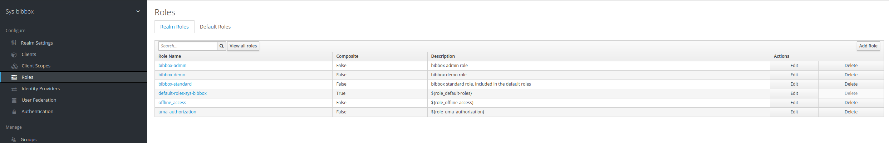
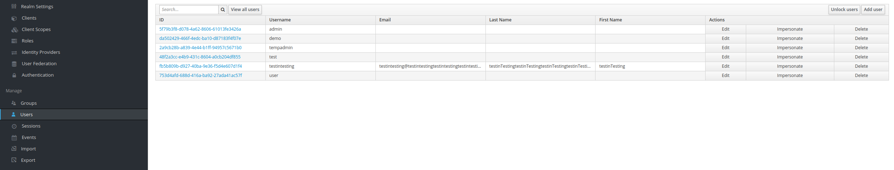

# User Management with Keycloak in the BIBBOX System
The official Keycloak documentation can be found [here](https://www.keycloak.org/documentation.html). 

## Prerequisites

The following prerequisites are required to run the bibbox system with Keycloak:

&nbsp;

**Admin Credentials for the Keycloak Console**

In your `.env` file, make sure that you have set the admin credentials for your Keycloak container as environment variables. These environment variables should be set as follows:

```bash
# credentials for the Keycloak admin console
KEYCLOAK_USER = admin
KEYCLOAK_PASSWORD = admin
```

Replace the values `admin` and `admin_password` with your desired admin credentials. These credentials will be used to log in to the Keycloak admin console. 

We also specify two initial client secrets in the `.env` file. These secrets are used for the initial setup of the bibbox system. The secrets should be set as follows:

```bash

KEYCLOAK_CLIENT_SECRET={secret} # this is the secret for the sys-bibbox-backend client
KEYCLOAK_ADMIN_CLIENT_SECRET={secret} # this is the secret for the admin-cli client which is used for managing the realm

```
In a production environment, the sys-admin should regenerate these two secrets after the initial setup, using the [Keycloak admin console](#keycloak-admin-console). The secrets should then be updated in the `.env` file.


Additionally, make sure that you have set the necessary environment variables for connecting to your PostgreSQL database. These are specified in the `docker-compose.yml` file. The default values should be sufficient for most use cases.


&nbsp;


**`KEYCLOAK_IMPORT` - Environment Variable**

This environment variable in the `docker-compose.yml` file allows you to specify a path to a custom Keycloak realm definition in JSON format. The realm definition can contain configurations for clients, roles, users, and more. The following code snippet shows how to specify the `KEYCLOAK_IMPORT` environment variable in the `docker-compose.yml` file:
  ```yaml
  environment:
    ...
    KEYCLOAK_IMPORT: /path/to/your/realm-definition.json
  ```

In our case, the realm definition is located in the `realm-export.json` file in the `keycloak/realms` folder. This file contains the configuration for the `sys-bibbox` realm, which is the realm that is used by the bibbox system. The realm definition contains the following configurations in addition to the regular configurations:

  - static client secrets for the `sys-bibbox-frontend` and `sys-bibbox-backend` clients for the initial setup

  - a default user:
    - username: `tempadmin`
    - password: `tempadmin`
    - role: `bibbox-admin`


&nbsp;


## Keycloak Integration in the Frontend Code

 In order for keycloak to work with our frontend, we will to specify the following in the `environment.ts`/`environment.prod.ts` file (or their respective templates, as we replace the `§§{{ENVPARAM}}` entries during installation). The `url` property should be set to the URL of our Keycloak instance, the `clientId` should be set to the client ID of our Angular application, and the `realm` should be set to the name of your Keycloak realm. Additionally, we specify an array called `non_protected_paths` consisting of non-protected paths that should not trigger the Keycloak login flow. Finally, we define the Keycloak roles that our application uses with the `roles` property. Any other custom configuration options for Keycloak should be set in the `KEYCLOAK_CONFIG` object aswell, like `max_instances_per_demo_user` which specifies the amount of instances a demo user is able to own.

```typescript
KEYCLOAK_CONFIG: {
    url: 'http://keycloak.'+ BASEURL +'/auth',
    // url: 'http://keycloak.'+ BASEURL +'/auth',
    realm: 'sys-bibbox',
    clientId: 'sys-bibbox-frontend',

    non_protected_paths: [
      '/logout',
      'https://raw.githubusercontent.com/',
    ],

    roles : {
      admin: 'bibbox-admin',
      demo_user: 'bibbox-demo',
      standard_user: 'bibbox-standard',
    },

    max_instances_per_demo_user: 0,
  },
```

&nbsp;

**Protecting Routes in the Frontend Code**:
In the Angular application, the relevant frontend URLs are protected by an `AuthGuard`, which checks if the user has a valid Keycloak token before allowing access to the page. Our frontend routes are specified in the `app-routing.module.ts` file. If we want to protect a route, we can simply add the `canActivate` property to the route and set it to the `AuthGuard`. This will cause the `AuthGuard` to be called before the route is loaded. If the user has a valid Keycloak token, the route will be loaded. If the user does not have a valid Keycloak token, the `AuthGuard` will redirect the user to the Keycloak login page. After the user has logged in, the `AuthGuard` will redirect the user back to the route that was originally requested. If we want to specify a route which requires elevated permissions, we can specify the roles that are allowed to access the route by using the `data` property of the route and specifying a `roles` array. The roles should be imported from the `environment.ts` file.

The following code snippet shows how to protect routes in the `app-routing.module.ts` file:

```typescript
// regular protected route, which can be accessed by any logged-in user
  { path: 'applications', component: ApplicationsComponent, pathMatch: 'full', canActivate: [AuthGuard]},


// if we have a route which has multiple data properties, we can use the following syntax:
  { path: 'fdp', component: ApplicationsComponent, resolve: { url: 'externalUrlRedirectResolver'}, data: {externalUrl: 'http://fdp.' + environment.BASEURL}, canActivate: [AuthGuard]},

// protected route, which can only be accessed by users with the admin role
  { path: 'sys-logs', component: SysLogsComponent, pathMatch: 'full', canActivate: [AuthGuard], data: {roles: [environment.KEYCLOAK_ROLES.admin]}},

// info page which is not protected, as any user should be able to access it, even if they are not logged in. As a result, we do not specify the canActivate property.
  { path: 'info', component: InfoComponent, pathMatch: 'full'},
```

&nbsp;

## Keycloak Integration in the Backend Code

**Protecting Routes in the Backend Code**
In our backend, we protect the api routes via a decorator function which takes optional parameters for routes with elevated required permissions. The decorator function is called `@auth_token_required()` and is located in the `bibbox/app/services/keycloak_service.py` file. The decorator function checks if a valid token is present in the header of the request to the api endpoint. If a valid token is present, the request is allowed to proceed. If no valid token is present, the decorator function will return a 401 error. If the optional `required-roles` parameter is specified, the decorator function will additionally check if the user has the required roles to access the endpoint. If the user does not have the required roles, the decorator function will return a 403 error.

We specify the roles we use in the bibbox system in the `bibbox/app/services/keycloak_service.py` file. The following code snippet shows how to specify the roles in the `KeycloakRoles` class. Their value should match the values specified in the `environment.ts` file in the frontend code aswell as the values specified in the keycloak-realm speccs in the keycloak container.


```python
# backend/app/services/keycloak_service.py
class KeycloakRoles:
    admin = 'bibbox-admin'
    standard = 'bibbox-standard'
    demo = 'bibbox-demo'
```


The following code snippet shows how to protect routes in the backend code:

```python
# backend/app/api/ping.py
from bibbox.app.services.keycloak import auth_token_required, KeycloakRoles

# this endpoint can be consumed by any client, as it does not require a valid token
@api.route('/ping/nonauth')
class Ping(Resource):
    @api.doc("Ping KeyCloak")
    def get(self):
        return 'NonAuth Pong', 200

# this endpoint can only be consumed by clients with a valid token
@api.route('/ping/user')
class Ping(Resource):
    @api.doc("Ping KeyCloak")
    @auth_token_required()
    def get(self):
        return 'User Pong', 200

# this endpoint can only be consumed by clients with a valid token and the admin role
@api.route('/ping/admin')
class Ping(Resource):
    @api.doc("Ping KeyCloak")
    @auth_token_required(roles=[KeycloakRoles.admin])
    def get(self):
        return 'Admin Pong', 200
```


**keycloak_service.py**

The `keycloak_service.py` file contains the `KeycloakAdminService` class, which is used to interact with the Keycloak API. When instanciated, the `KeycloakAdminService` class will connect to the Keycloak API by using the credentials specified in the environment variables. The `KeycloakAdminService` class is used for user management and contains CRUD methods for users, functionalities for assigning roles to users, and functionalities for querying user-roles.


## Keycloak Admin Console

The following sections provide a brief overview of the most important features of the Keycloak admin console.

**Realms and Clients**: The Keycloak admin console can be used to manage users, clients, and roles. If your have the bibbox system running locally, the admin console can be accessed at `http://localhost:5014/auth/admin/`. The admin credentials are specified in the `.env` file. Once you have logged in, you can create new realms and clients, add new users, and assign roles to users. The following sections provide a brief overview of the most important features of the Keycloak admin console.

Realms in Keycloak are security domains, which can be thought of as a container for a set of users, credentials, and groups. Each realm has its own authentication configuration, clients, roles, and policies. Clients are applications that can be registered within a realm to enable their secure access using Keycloak. Clients have a unique identifier, a set of roles, and can be configured with specific authentication flows and settings.

Realm Settings - General


Note that the Name specified here must match the name of the realm specified in the `KEYCLOAK_REALM` property in the `environment.ts/environment.prod.ts` file for the frontend aswell as the `.env` file for the backend. 


&nbsp;

Realm Settings - Login


On this page, multiple different login options can be configured. For example, you can enable the registration page, which allows users to register themselves. You can also enable the forgot password page, which allows users to reset their password if they have forgotten it (there needs to be a set-up and running email service for this to work). Additionally, you can configure the login theme, which determines the look and feel of the login page.

&nbsp;


Clients - General

This page shows an overview of all clients that have been registered in the realm. You can create new clients by clicking the `Create` button in the top right corner.
In the case of the bibbox system, the following clients are explicitly used:
- sys-bibbox-backend
- sys-bibbox-frontend
- admin-cli

While the frontend client is public, the backend client and the admin-cli client have `Access Type: Confidential` set, which requires a secret to initiate the login protocol. The secret is specified in the `.env` file. The backend client is used for authenticating requests to the backend API. The admin-cli client is used for managing the realm and is created by default.


&nbsp;


On this page, you can configure the client settings. 
Noteworthy settings are:
- **Access Type**: This setting determines whether the client is public or confidential. Public clients are clients that can be used by any user, while confidential clients are clients that require a secret to be used. In the case of the bibbox frontend, the client is public, so the `public` option should be selected.
- **Valid Redirect URIs**: This setting determines which URLs are allowed to be redirected to after a successful login. In the case of the bibbox frontend, the URL will be replaced in the `realm-export.json.template` file during the installation process. The URL should be set to the URL of the frontend.
- **Web Origins**: CORS settings for the client. * is a wildcard that will match any origin.
- **Base URL**: The base URL of the client. This is used for the `back to application` link in the Keycloak login page.
- **Enabled**: This setting determines whether the client is enabled or not. If the client is disabled, it will not be able to authenticate users. The client should be enabled.

In the advanced settings, settings regarding the session lifetime and token lifetime can be configured. The default values should be sufficient for most use cases.

&nbsp;



On this page, we can specify roles to be used in the `sys-bibbox` realm. In the case of the bibbox system, the following non-default roles are used:
- bibbox-admin
- bibbox-standard
- bibbox-demo

The option to define client specific roles exists, however we opted to use `realm-roles` instead, as this allows us to use the same roles across multiple clients.



On this page, we can add new users to the `sys-bibbox` realm. The `realm-export.json` file contains a default user with the following credentials:
- username: `tempadmin`
- password: `tempadmin`
- role: `bibbox-admin`