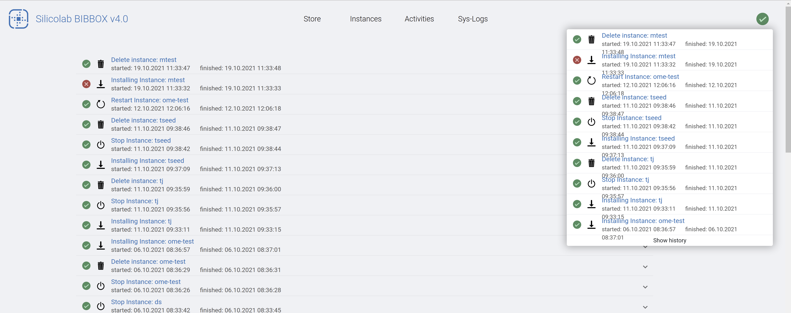
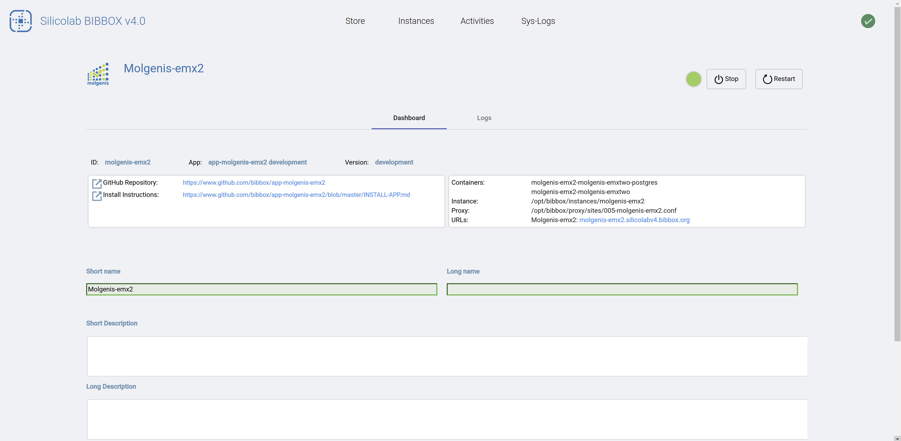
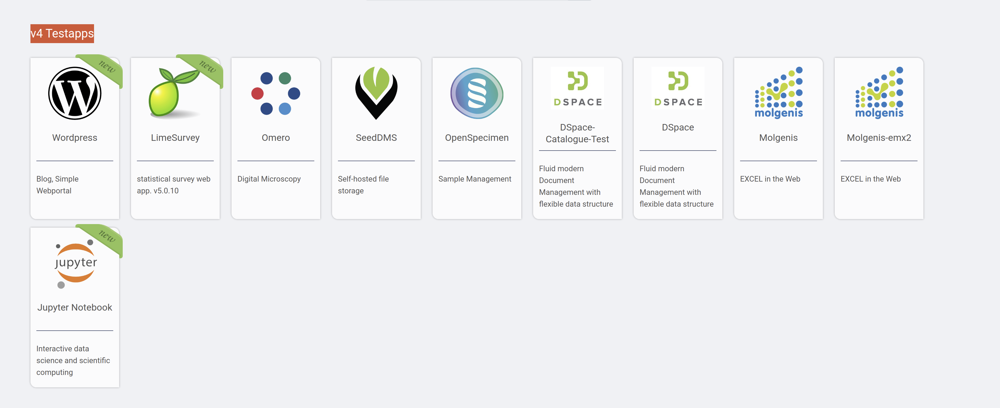
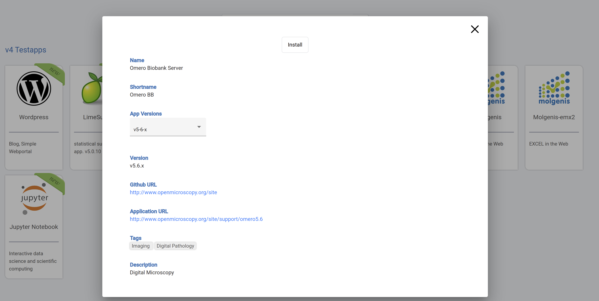

#  BIBBOX user guide

## User guide

The first page of the BIBBOX shows you the landing page and give you the opportunity to sign in.

By clicking onto the <a href="https://demo.bibbox.org/applications" target="_blank">Store</a>-Button on top you will get to the App overview. 

To learn more about installing an App goto [Install Apps](#install-apps)

Clicking onto the Instances-Button will take you to the currently installed instances.

* NOTE: If you freshly installed your  BIBBOX locally you might have not installed any instances and this screen is empty.

The screen shows the currently installed instances and offers more possibilities. You can:

* Call the Apps UI via the switch button on the top left of the Apps tile
* See the Apps dashboard by clicking the gear symbol on the bottom left of the Apps tile
* Call the logs of the singular Docker containers by clicking the book symbol in the bottom-middle of the Apps tile
* The light signifies the status of the App - Green: Running; Yellow: Installing; Red: Stopped

You might noticed, that on all screens there is a little green hook on the very top right of the page. This is a short link to the last page of the third page of top navigation bar: The activity menu. 

Here all the recently triggered actions can be reviewed. Additionally the status

* Hook &rarr; suceeded
* Red cross sign &rarr; failed
* Spinning Bar circle &rarr; task in Progression

is shown here. The dropdown menu alwys present on the top right just gives you a short update on the general status of recent event, while in the Activities tab each event can be expanded and contains a short descriptions about the nature of the given error.

As this might is not enough one can conveniently access the system logs from the main navigation as well. This tab shows the docker-logs of the main system containers.

Each log can be expanded by clicking on it and shows the logs that are recorded by each individual docker container

* NOTE: This is also the fastest way to figure out the main structure of the  BIBBOX system
* NOTE: What is logged exactly is configured in the Docker Container definitions and can be found within the Dockerfiles within the GitHub repository (<a href="https://github.com/bibbox/sys-bibbox/tree/master/apacheproxy" target="_blank">apacheproxy/</a> as an example for the Apache Proxy Server container)

As the information provided by the logs is sometimes not enough each App can be troubleshot in more detail by visiting the Dashboard (it can be accesed in the Instances Tab)

* NOTE: The most important part is the possibility to stop or restart Apps.
* NOTE: Once an App has been stoped the button turns towards delete. THIS IS THE ONLY WAY TO DELETE APPS
* Additionally we can enter or read descriptions that are shown within the Apps tile at the Instances tab. Further we can see all the available URL's for the given App. For example some Apps include additional tools for debuging or advacned form of integration. An example would be an additional Adminer service that can be accesed to see the database.

Last we can also access the App-Container Docker logs from the Dashboard or via the Apps tile from the Instances tab (book symbol see Instances tab above). 

Here we can see a more detailed log of every container that is contributing to the given App. 

## Install Apps

Apps can be installed from the Store page.

* NOTE: After first installation of the framework the system automatically fetches the list of available Apps this can take a few moments.

Once you selected an App by clicking on its icon you will see a new window pop up. Since there can be different versions of an App available you have to select your version

After this click Install as shown on top of the image above. Next you will have to fill the parameters neccesary to actually run the App. 
The parameters themselves can be checked at the App's GitHub repository. In the example the selected App is <a href="https://www.openmicroscopy.org/omero/" target="_blank">Omero</a>. 
After clicking onto Install you will be taken to the parameter setting screen:

To get to the GitHub repository outlining the parameters go to: <a href="https://github.com/bibbox/app-omero/tree/v5-6-x" target="_blank">app-omero</a>

